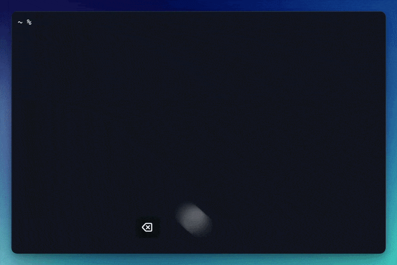

# Labrys

A personal terminal tool I made for the Kubeflow notebooks I use at work.

It allows me to start a notebook, get a shell or a VS Code window, and stop it
when I'm done. It also connects to my 1Password and automatically handles
credentials. Basically, it keeps everything in one place so I don't have to
juggle kubeconfigs and SSH connections all the time.

If your setup looks similar, it might be useful.

Run it with `lab`, or `labrys` if you prefer the full name. They are the same command.

<div align="center">
  
</div>


## Trying it

You'll need [uv](https://docs.astral.sh/uv/) and a read-only 1Password Service
Account. From this checkout:

```sh
uv tool install --python 3.12 .
lab init
```

Put a `<cluster-name>.yaml` in the profile directory you picked during init.
There's a [template](profiles/template.yaml) and an
[Agent Skill](.agents/skills/lab-profile/SKILL.md) to help with that.

```sh
lab cluster add
lab
```

The prompts walk through the 1Password steps; you still save the items in the
app. Quitting lab leaves the notebook running. Use Stop when you're done with it.

[Usage](docs/usage.rst) · [Configuration](docs/configuration.rst) · [Validation notes](docs/validation.rst)
